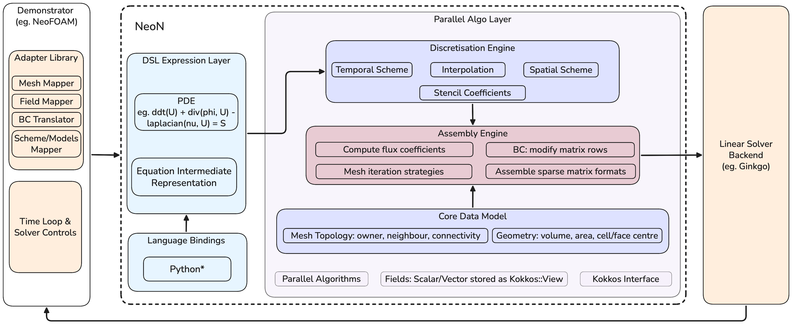
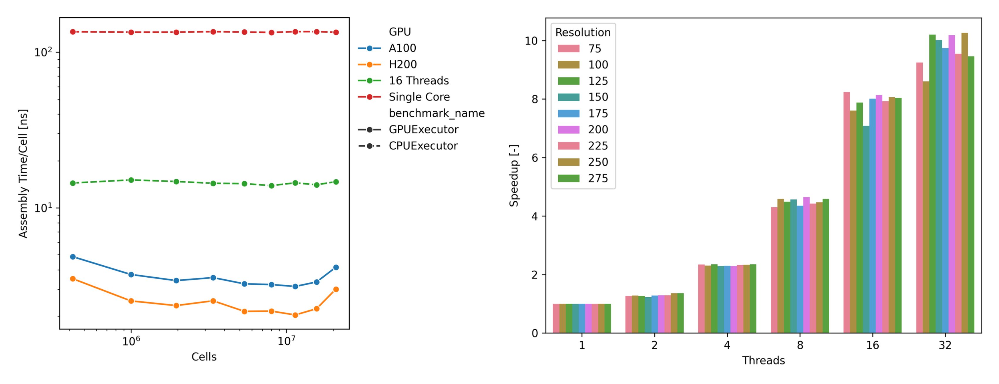

# Abstract
NeoN is an open-source C++20-compliant library for developing high-performance computational fluid dynamics (CFD) software on heterogeneous GPU and multicore CPU systems. It provides a domain specific language (DSL) for expressing finite-volume equations while retaining fine-grained control over discretisation, matrix assembly and execution. Discretisation policies generate stencil coefficients, which are assembled into standard sparse matrix formats (e.g., CSR) and solved using external linear solver backends such as Ginkgo. NeoN utilises lazy evaluation to defer matrix assembly until execution. This architecture avoids temporaries and enables optimisations on the abstract syntax tree (AST), for example via fused GPU kernels with higher arithmetic intensity. Additionally, NeoN is designed for easy integration with other CFD frameworks through its powerful API. To ensure performance across architectures while guaranteeing correct results, NeoN employs a robust continuous integration system that includes automated build validation, extensive GPU compatibility testing on AMD, NVIDIA, and Intel GPU devices, and automated benchmarking.

# Statement of Need
The finite volume method (FVM) is a widely used discretisation approach in academic and industrial CFD applications due to its robustness and flexibility. However, many of the widely used CFD frameworks were originally designed for single-core or moderately parallel CPU architectures. Since the inception of classical open-source FVM codes like OpenFOAM [@weller1998] and code_saturne [@archambeau2004], floating-point operations have become comparatively cheaper than memory operations. Modern high-performance computing (HPC) platforms are inherently parallel, with hierarchical memory systems and accelerator-centric architectures, where performance is often limited by memory bandwidth rather than compute capability - an issue particularly relevant for CFD workflows, which are typically memory-bound with low arithmetic intensity. Driven by strong adoption of AI technology, GPUs and other accelerators are now widely used in scientific computing, and legacy CFD codes often rely on backend-specific adaptations or refactoring that complicate performance optimisation on such architectures [@olenik2024]

NeoN targets this gap by providing a versatile performance-portable CFD core that seamlessly integrates GPU-native data structures and finite-volume operator abstractions within a unified programming model. Using Kokkos [@trott2022] to implement a platform-portable parallelisation layer and a domain-specific interface for discretisation operators, NeoN enables the creation of modern CFD solvers, as demonstrated in NeoFOAM [@neofoam]. These solvers can efficiently target a variety of CPU-GPU architectures without being restricted to a single hardware backend or requiring duplicate numerical implementations. Additionally, through its companion project NeoFOAM, NeoN facilitates progressive modernisation of legacy solvers, including OpenFOAM-based codes, with minimal refactoring.

# State of the field
Over the past two decades, significant efforts have been devoted to developing an abstraction mechanism and domain-specific representations for FVM approaches. Early CFD frameworks, such as OpenFOAM, introduced object-oriented tensorial abstractions [1] in C++, enabling finite-volume discretisations to be expressed in a compact and expressive form that has seen widespread industrial adoption. Despite their success, these abstractions are typically integrated within solver-specific infrastructures, making it difficult to reuse finite-volume components or achieve interoperability between independently developed CFD frameworks.
Embedded DSLs like Life [@prudhomme2007] demonstrate improved expressiveness of numerical formulations, yet struggle with solver-agnostic semantics and performance portability. In contrast, external DSLs and code-generation frameworks - such as ExaSlang [@kuckuk2016], ExaStencils [@lengauer2014] and Dawn [@osuna2020] have enabled aggressive optimisation of stencil-based operators [@kuckuk2017]. However, they are restricted to structured discretisations and predefined numerical patterns, and are not designed to support the unstructured FV methods prevalent in general-purpose and industrial CFD. Recent efforts, such as Finch [@heisler2022] and ProtoX [@mankad2024], offer high performance portability, although they remain closely tied to specific solver frameworks, grid structures, or code-generation pipelines.
The existing works demonstrate that core finite-volume concepts - such as flux evaluation, control-volume integration, and discrete operators - can be expressed at a high level and optimised effectively when decoupled. Yet, a persistent gap remains: the lack of a modular CFD core that integrates high-level finite-volume abstractions with performance-portable execution on heterogeneous CPU-GPU architectures. NeoN aims to address this gap by combining the usability of embedded DSLs with the optimisation potential of external DSL approaches through a high-level finite-volume operator interface with lazy evaluation and performance-portable execution on heterogeneous architectures.

# Software design
{width=100%}

NeoN is built around a layered, modular architecture as illustrated in Figure 1. Its design cleanly separates the distinct stages: application control, DSL-based equation representation, discretisation, linear algebra assembly, and hardware execution. This separation allows each layer to evolve independently, making the framework highly extensible and maintainable.
At the heart of NeoN is a C++ embedded DSL that allows users to express finite-volume equations in a form close to their mathematical intent. Differential operators like ddt, div, laplacian, or grad can be composed directly into equation expressions, for example:

```cpp
auto expr = dsl::imp::ddt(U) + dsl::imp::div(phi, U) - dsl::imp::laplacian(nu, U);
```
**Listing 1:** Example expression with multiple differential operators.

Rather than evaluating the operators of the expressions eagerly, NeoN employs lazy evaluation to build an intermediate representation that is later interpreted by the discretisation engine. This approach avoids unnecessary temporary allocations and reduces memory traffic. Thus, the expression shown in Lst. 1 is only fully assembled when an operation like solve(expr, …) requires the assembly.
The discretisation engine then applies selected temporal and spatial schemes to generate local stencil contributions for the finite-volume formulation. The core data model encapsulates mesh topology, geometric metrics, and scalar or vector fields in performance-portable memory abstractions. These contributions are then forwarded to an assembly engine that constructs sparse linear systems using standard formats such as CSR and COO, rather than solver-specific representations. This design choice improves interoperability with external solver libraries. NeoN integrates Ginkgo [@anzt2022; @ginkgo] to solve the resulting sparse linear systems, providing access to portable and scalable iterative solvers and preconditioners.
High-level workflow concerns such as time loops, solver control, and I/O are intentionally handled outside the core library by external applications. The NeoFOAM demonstrator illustrates how NeoN can integrate into OpenFOAM-style workflows. In addition, a language-binding layer enables the use of NeoN’s DSL from languages such as Python.

# Performance Evaluation
{width=100%}

To evaluate the performance of NeoN, the wall-clock time required for the matrix assembly of the expression defined in Listing 1 is measured across multiple hardware backends and problem sizes. The computational domain consists of a unit cube discretised using a uniform hexahedral mesh with varying resolutions. Benchmarks are conducted on representative high-performance computing hardware, including an AMD EPYC 9555 processor (64 cores) and NVIDIA A100 and H200 GPUs. Figure 1a reports the assembly time per cell for different grid resolutions, comparing single-core CPU execution, multi-core CPU execution (16 threads), and GPU execution on an A100 and H200 device. The results indicate that GPU acceleration yields a reduction in assembly time per cell by approximately a factor of 20 to 50 relative to single-core CPU execution.
In addition, strong scaling experiments using the OpenMP backend on up to 32 CPU cores are presented in Figure 1b. A speedup of approximately 10x is achieved when scaling from one to 32 threads. Beyond this point, no further performance gains are observed, which is attributed to memory bandwidth limitations leading to increased contention among threads.

# Acknowledgements
Parts of this work were supported by the German Federal Ministry of Education and Research (grant number 16ME0676K).

# References
