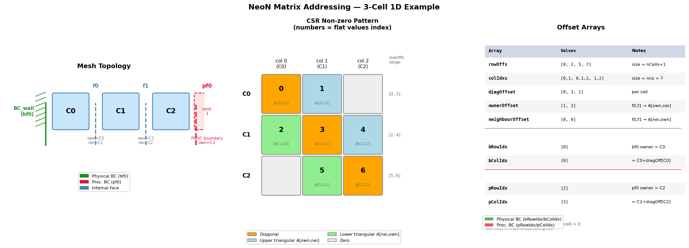

.. _linearAlgebra_matrixAddressing:

Matrix Addressing
=================

Overview
--------

Finite-volume discretisation produces a sparse linear system :math:`A \mathbf{x} = \mathbf{b}`
where each row corresponds to a mesh cell and each non-zero off-diagonal entry corresponds to a
face shared by two cells.  NeoN assembles this system in three parts:

- **Local CSR matrix** — all cell-to-cell connections within the current MPI rank.
- **Physical-boundary COO matrix** — contributions from Dirichlet/Neumann boundaries.
- **Processor-boundary COO matrix** — contributions from faces shared with neighbouring MPI ranks.

The central object that links mesh topology to matrix storage is
``FaceToMatrixAddress`` (``include/NeoN/linearAlgebra/faceToMatrixAddress.hpp``).
It stores three compact offset arrays (``diagOffset``, ``ownerOffset``, ``neighbourOffset``)
that map every mesh face to a position inside the flat ``values`` array of the CSR matrix.

Further details:

* `FaceToMatrixAddress <https://exasim-project.com/NeoN/latest/doxygen/html/classNeoN_1_1la_1_1FaceToMatrixAddress.html>`_
* `LinearSystem <https://exasim-project.com/NeoN/latest/doxygen/html/classNeoN_1_1la_1_1LinearSystem.html>`_

CSR Format
----------

The local matrix is stored in **Compressed Sparse Row (CSR)** format via
``SparsityPattern`` (``include/NeoN/linearAlgebra/sparsityPattern.hpp``):

.. code-block:: cpp

    Vector<IndexType> rowOffs_;   // size nCells + 1
    Vector<IndexType> colIdxs_;   // size nnz (number of non-zeros)
    // values stored separately in Matrix::values_

``rowOffs[i+1] - rowOffs[i]`` gives the number of non-zeros in row ``i``.
Iterating over row ``i``:

.. code-block:: cpp

    for (localIdx k = rowOffs[i]; k < rowOffs[i+1]; ++k)
    {
        // colIdxs[k] is the column index
        // values[k]  is A[i, colIdxs[k]]
    }

Row Layout: Lower | Diagonal | Upper
-------------------------------------

Within every row the non-zero entries are stored in the order:

.. code-block:: text

    Row i: [ A[i,j0] ... A[i,j_{k-1}] | A[i,i] | A[i,j_{k+1}] ... A[i,j_{m}] ]
           |<----- lower (j < i) ----->|<-diag->|<----- upper (j > i) -------->|

``diagOffset[i]`` equals the count of lower-triangular entries in row ``i``, which is also
the number of internal faces for which cell ``i`` is the *neighbour* (i.e. has a smaller
index than the owner).

Face Addressing Arrays
----------------------

``FaceToMatrixAddress`` stores three ``uint8_t`` arrays:

.. list-table::
   :header-rows: 1
   :widths: 25 20 55

   * - Array
     - Size
     - Meaning
   * - ``diagOffset[celli]``
     - ``nCells``
     - Offset of the diagonal entry within cell ``celli``'s row.
   * - ``ownerOffset[facei]``
     - ``nInternalFaces``
     - Offset within the *owner* cell's row for the column pointing at the *neighbour* cell.
       Gives the upper-triangular entry :math:`A[\text{own},\text{nei}]`.
   * - ``neighbourOffset[facei]``
     - ``nInternalFaces``
     - Offset within the *neighbour* cell's row for the column pointing at the *owner* cell.
       Gives the lower-triangular entry :math:`A[\text{nei},\text{own}]`.

Helper functions (``faceToMatrixAddress.hpp:136-153``) convert offsets to flat ``values`` indices:

.. code-block:: cpp

    // Flat index of diagonal for cell i:
    localIdx diagIdx(localIdx celli) const
    {
        return rowOffs[celli] + diagOffset[celli];
    }

    // Flat index of A[nei, own]  (lower triangular, "upper" in CFD naming — see TODO below):
    localIdx upperIdx(localIdx celli, localIdx faceIdx) const
    {
        return rowOffs[celli] + neighbourOffset[faceIdx];
    }

    // Flat index of A[own, nei]  (upper triangular, "lower" in CFD naming — see TODO below):
    localIdx lowerIdx(localIdx celli, localIdx faceIdx) const
    {
        return rowOffs[celli] + ownerOffset[faceIdx];
    }

.. todo::

   **Naming inconsistency — ``upperIdx`` / ``lowerIdx``.**

   The function names are **inverted** relative to standard matrix LDU convention:

   * ``upperIdx(nei, f)`` currently returns the flat index of :math:`A[\text{nei},\text{own}]`,
     which is the *lower*-triangular entry (row > col).
   * ``lowerIdx(own, f)`` currently returns the flat index of :math:`A[\text{own},\text{nei}]`,
     which is the *upper*-triangular entry (row < col).

   The intended (corrected) semantics should be:

   * ``upperIdx(own, f)`` → :math:`A[\text{own},\text{nei}]` with own < nei (upper triangular).
   * ``lowerIdx(nei, f)`` → :math:`A[\text{nei},\text{own}]` with nei > own (lower triangular).

   These functions should be renamed or their implementations swapped for consistency with the
   LDU naming convention used everywhere else in NeoN and OpenFOAM.
   See ``faceToMatrixAddress.hpp:136-153`` and the usage in
   ``src/finiteVolume/cellCentred/operators/gaussGreenDiv.cpp:310-341``.

Concrete 3-Cell Example
------------------------

Mesh Topology
^^^^^^^^^^^^^

Consider a 1-D mesh of three cells on rank 0:

.. code-block:: text

                  f0              f1
    +---------+  |  +---------+  |  +---------+
    |         |--+--|         |--+--|         |
    |   C0    |     |   C1    |     |   C2    |
    |         |     |         |     |         |
    +---------+     +---------+     +---------+
         |                               |
     bf0 (BC_wall)               pf0 (PROC rank 1)

- **Internal faces:** f0 (own=C0, nei=C1), f1 (own=C1, nei=C2)
- **Physical boundary face:** bf0 — left wall of C0
- **Processor boundary face:** pf0 — right side of C2, shared with rank 1

The local matrix has shape 3×3 with 7 non-zeros (2 entries per interior face plus 3 diagonals).

   Generated by ``generate_matrix_addressing_figure.py``.
   Left: mesh topology. Centre: CSR non-zero pattern with flat value indices.
   Right: all offset arrays.

Construction Walkthrough
^^^^^^^^^^^^^^^^^^^^^^^^

``setSparsityPatternFaceToMatrixAddressSerial`` (``src/linearAlgebra/faceToMatrixAddress.cpp:171-280``)
builds the arrays in five passes:

**Step 1 — count non-zeros per cell** (initialised to 1 for the diagonal):

.. code-block:: text

    nFacesPerCell = [1, 1, 1]
    f0: nFacesPerCell[C0]++, nFacesPerCell[C1]++  → [2, 2, 1]
    f1: nFacesPerCell[C1]++, nFacesPerCell[C2]++  → [2, 3, 2]

**Step 2 — compute row offsets** (exclusive prefix sum):

.. code-block:: text

    rowOffs = [0, 2, 5, 7]

**Step 3 — assign lower-triangular positions** (nFacesPerCell reset to 0):

For each face, the *neighbour* cell receives a new position for the column=own entry:

.. code-block:: text

    f0: segIdx = nFacesPerCell[C1]++ = 0 → neighbourOffset[f0] = 0, colIdx[2+0] = C0
    f1: segIdx = nFacesPerCell[C2]++ = 0 → neighbourOffset[f1] = 0, colIdx[5+0] = C1

**Step 4 — place diagonal**:

.. code-block:: text

    C0: diagOffset[C0] = nFacesPerCell[C0] = 0, colIdx[0+0] = C0, nFacesPerCell[C0] = 1
    C1: diagOffset[C1] = nFacesPerCell[C1] = 1, colIdx[2+1] = C1, nFacesPerCell[C1] = 2
    C2: diagOffset[C2] = nFacesPerCell[C2] = 1, colIdx[5+1] = C2, nFacesPerCell[C2] = 2

**Step 5 — assign upper-triangular positions** (positions start after the diagonal):

For each face, the *owner* cell receives a new position for the column=nei entry:

.. code-block:: text

    f0: segIdx = nFacesPerCell[C0]++ = 1 → ownerOffset[f0] = 1, colIdx[0+1] = C1
    f1: segIdx = nFacesPerCell[C1]++ = 2 → ownerOffset[f1] = 2, colIdx[2+2] = C2

Resulting Arrays
^^^^^^^^^^^^^^^^

.. list-table::
   :header-rows: 1
   :widths: 30 40 30

   * - Array
     - Values
     - Notes
   * - ``rowOffs``
     - ``[0, 2, 5, 7]``
     - size = nCells+1 = 4
   * - ``colIdxs``
     - ``[0, 1,  0, 1, 2,  1, 2]``
     - size = nnz = 7
   * - ``diagOffset``
     - ``[0, 1, 1]``
     - one entry per cell
   * - ``ownerOffset``
     - ``[1, 2]``
     - one entry per internal face
   * - ``neighbourOffset``
     - ``[0, 0]``
     - one entry per internal face

Values Array Layout
^^^^^^^^^^^^^^^^^^^

.. list-table::
   :header-rows: 1
   :widths: 15 20 30 35

   * - Flat index
     - Row (cell)
     - Column (cell)
     - Matrix entry
   * - 0
     - C0
     - C0
     - A[C0,C0] — diagonal
   * - 1
     - C0
     - C1
     - A[C0,C1] — upper triangular (f0)
   * - 2
     - C1
     - C0
     - A[C1,C0] — lower triangular (f0)
   * - 3
     - C1
     - C1
     - A[C1,C1] — diagonal
   * - 4
     - C1
     - C2
     - A[C1,C2] — upper triangular (f1)
   * - 5
     - C2
     - C1
     - A[C2,C1] — lower triangular (f1)
   * - 6
     - C2
     - C2
     - A[C2,C2] — diagonal

Verification with Helper Functions
^^^^^^^^^^^^^^^^^^^^^^^^^^^^^^^^^^^

Using the helper functions:

.. code-block:: cpp

    // Diagonal access
    diagIdx(C0) = rowOffs[0] + diagOffset[0] = 0 + 0 = 0  → values[0] = A[C0,C0] ✓
    diagIdx(C1) = rowOffs[1] + diagOffset[1] = 2 + 1 = 3  → values[3] = A[C1,C1] ✓
    diagIdx(C2) = rowOffs[2] + diagOffset[2] = 5 + 1 = 6  → values[6] = A[C2,C2] ✓

    // Upper triangular A[own,nei] — via lowerIdx(own, face) (see naming TODO above)
    lowerIdx(C0, f0) = rowOffs[0] + ownerOffset[f0]     = 0 + 1 = 1  → values[1] = A[C0,C1] ✓
    lowerIdx(C1, f1) = rowOffs[1] + ownerOffset[f1]     = 2 + 2 = 4  → values[4] = A[C1,C2] ✓

    // Lower triangular A[nei,own] — via upperIdx(nei, face) (see naming TODO above)
    upperIdx(C1, f0) = rowOffs[1] + neighbourOffset[f0] = 2 + 0 = 2  → values[2] = A[C1,C0] ✓
    upperIdx(C2, f1) = rowOffs[2] + neighbourOffset[f1] = 5 + 0 = 5  → values[5] = A[C2,C1] ✓

LDU to CSR Correspondence
--------------------------

OpenFOAM's classical LDU format stores three separate arrays: ``diag``, ``lower``, and ``upper``.
NeoN encodes the same information in a single ``values`` array.  The mapping for the 3-cell
example is:

.. list-table::
   :header-rows: 1
   :widths: 25 40 20

   * - LDU concept
     - NeoN access
     - Flat index
   * - ``diag[C0]``
     - ``values[diagIdx(C0)]``
     - 0
   * - ``upper[f0]`` = A[C0,C1]
     - ``values[lowerIdx(C0, f0)]``
     - 1
   * - ``lower[f0]`` = A[C1,C0]
     - ``values[upperIdx(C1, f0)]``
     - 2
   * - ``diag[C1]``
     - ``values[diagIdx(C1)]``
     - 3
   * - ``upper[f1]`` = A[C1,C2]
     - ``values[lowerIdx(C1, f1)]``
     - 4
   * - ``lower[f1]`` = A[C2,C1]
     - ``values[upperIdx(C2, f1)]``
     - 5
   * - ``diag[C2]``
     - ``values[diagIdx(C2)]``
     - 6

A typical operator assembly kernel (e.g. ``gaussGreenDiv.cpp:310-341``) follows the pattern:

.. code-block:: cpp

    auto own = faceOwner[facei];
    auto nei = faceNeighbour[facei];

    // A[nei, own] — lower triangular entry in nei's row:
    values[rowOffs[nei] + neighbourOffset[facei]] += fluxNei;

    // A[own, nei] — upper triangular entry in own's row:
    values[rowOffs[own] + ownerOffset[facei]]     += fluxOwn;

    // Update diagonals:
    Kokkos::atomic_sub(&values[rowOffs[own] + diagOffset[own]], fluxOwn);
    Kokkos::atomic_sub(&values[rowOffs[nei] + diagOffset[nei]], fluxNei);

Physical Boundary Contributions (COO)
--------------------------------------

A physical boundary face (wall, inlet, outlet, …) touches only one cell — the owner.
Its contribution modifies the **diagonal** of that cell's row and the right-hand side.
No off-diagonal coupling is introduced, so a full CSR row is unnecessary.

NeoN stores physical boundary contributions in a ``CooSparsityPattern``
(``include/NeoN/linearAlgebra/sparsityPattern.hpp:141-210``):

- ``rowOffs[bfacei]`` = owner cell index
- ``colIdx[bfacei]``  = ``celli + diagOffset[celli]``  (see note below)

Built in ``setBoundarySparsityPattern`` (``faceToMatrixAddress.cpp:104-134``):

.. code-block:: cpp

    // For boundary face bfacei touching owner cell celli:
    bColIdx[bfacei] = celli + diagOffset[celli];
    bRowIdx[bfacei] = celli;

For the 3-cell example (bf0 → C0):

.. code-block:: text

    bRowIdx = [0]    (owner cell = C0 = 0)
    bColIdx = [0]    (= C0 + diagOffset[C0] = 0 + 0 = 0)

.. note::

   The ``colIdx`` formula uses ``celli + diagOffset[celli]``, **not** the full flat CSR index
   ``rowOffs[celli] + diagOffset[celli]``.  The two are equal only for cell 0 (where
   ``rowOffs[0] = 0``).  How this value is consumed by ``CommunicationPattern`` in
   ``LinearSystem::communicate()`` (``linearSystem.hpp:195-241``) should be verified before
   relying on ``colIdx`` as a direct index into ``matrix_.values()``.

Processor Boundary Contributions (COO)
---------------------------------------

A processor boundary face couples a cell on the local rank to a cell on a neighbouring rank.
The remote cell's value is not stored locally; it arrives via MPI.  After the exchange, the
received contribution is subtracted from the **diagonal** of the local owner cell.

The sparsity is again COO, built in ``setProcBoundarySparsityPattern``
(``faceToMatrixAddress.cpp:136-167``):

.. code-block:: cpp

    // For proc-boundary face bfacei touching local cell celli:
    pColIdx[bfacei] = celli + diagOffset[celli];
    pRowIdx[bfacei] = celli;

For the 3-cell example (pf0 → C2):

.. code-block:: text

    pRowIdx = [2]    (owner cell = C2 = 2)
    pColIdx = [3]    (= C2 + diagOffset[C2] = 2 + 1 = 3)

The MPI exchange happens in ``LinearSystem::communicate()``
(``linearSystem.hpp:195-241``):

1. Copy processor-boundary values to send buffer.
2. ``MPI_Alltoallv`` exchanges contributions with all neighbouring ranks.
3. Subtract received values from the local CSR matrix diagonal via
   ``sub(recvBuffer, boundaryMatrixMap, matrix_.values())``.

.. warning::

   As with physical boundaries, ``pColIdx = celli + diagOffset[celli]`` differs from the true
   flat CSR diagonal index (``rowOffs[celli] + diagOffset[celli]``) for cells beyond cell 0.
   Verify the scatter logic in ``LinearSystem::communicate()`` and
   ``CommunicationPattern::boundaryMapVector`` before adding new processor-boundary operators.

How to Access Values in Practice
----------------------------------

.. code-block:: cpp

    auto mi     = ls.faceToMatrixAddress();    // FaceToMatrixAddress
    auto values = ls.matrix().values().view(); // flat values array

    // 1. Diagonal of cell i:
    values[mi->diagIdx(i)] += contribution;

    // 2. A[own, nei] (upper triangular) for internal face f:
    //    NOTE: currently accessed via lowerIdx — see naming TODO.
    values[mi->lowerIdx(own, f)] += contribution;

    // 3. A[nei, own] (lower triangular) for internal face f:
    //    NOTE: currently accessed via upperIdx — see naming TODO.
    values[mi->upperIdx(nei, f)] += contribution;

    // 4. Physical or processor boundary contribution:
    //    Write directly to boundaryMatrix; NeoN scatters it to the CSR
    //    diagonal automatically during LinearSystem::communicate().
    ls.boundaryMatrix().values().view()[bcFaceIdx] += bcContribution;
