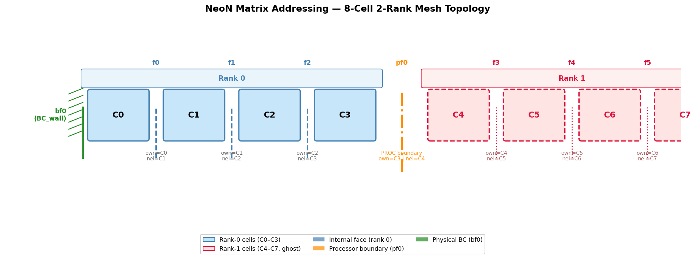
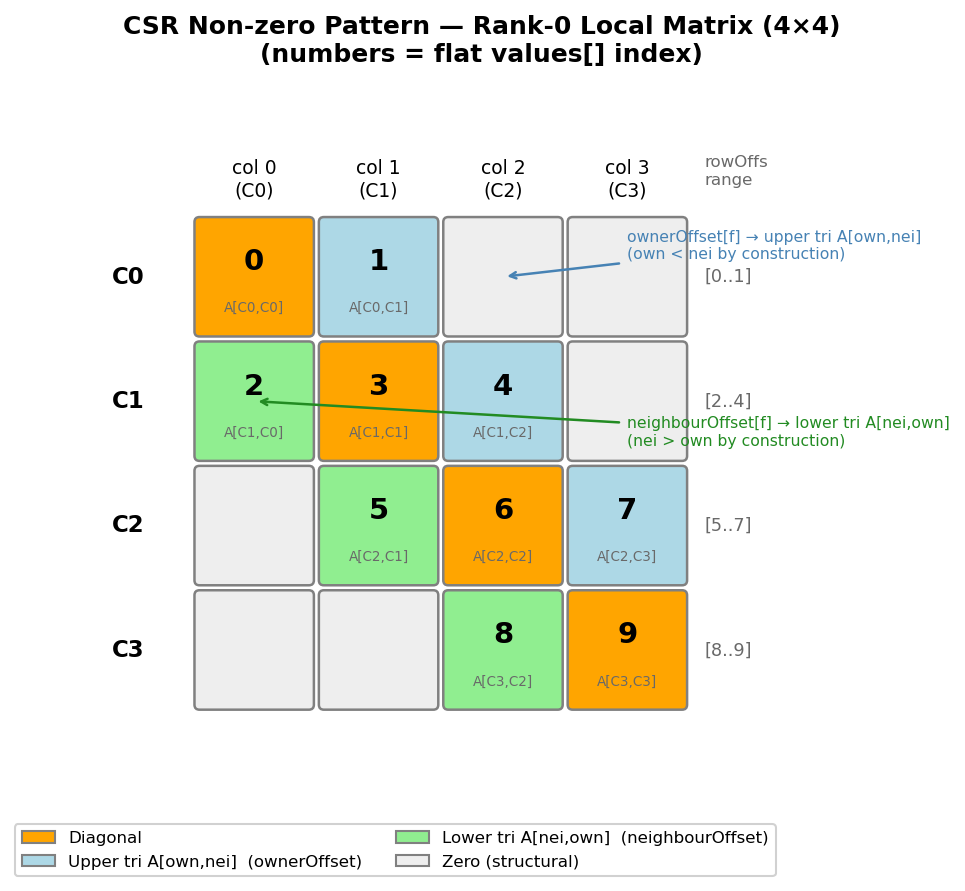

.. _linearAlgebra_matrixAddressing:

Matrix Addressing
=================

Overview
--------

Finite-volume discretisation produces a sparse linear system :math:`A \mathbf{x} = \mathbf{b}`
where each row corresponds to a mesh cell and each non-zero off-diagonal entry corresponds to a
face shared by two cells.  NeoN assembles this system in three parts:

- **Local system matrix** — all cell-to-cell connections within the current MPI rank.
- **Physical-boundary matrix** — contributions from Dirichlet/Neumann boundaries.
- **Processor-boundary matrix** — contributions from faces shared with neighbouring MPI ranks.

The central object that links mesh topology to matrix storage is
``FaceToMatrixAddress`` (``include/NeoN/linearAlgebra/faceToMatrixAddress.hpp``).
It stores three compact offset arrays (``diagOffset``, ``ownerOffset``, ``neighbourOffset``)
that map every mesh face to a position inside the flat ``values`` array of the corresponding matrix.

Further details:

* `FaceToMatrixAddress <https://exasim-project.com/NeoN/latest/doxygen/html/classNeoN_1_1la_1_1FaceToMatrixAddress.html>`_
* `LinearSystem <https://exasim-project.com/NeoN/latest/doxygen/html/classNeoN_1_1la_1_1LinearSystem.html>`_

Currently, only two matrix formats are supported: CSR and COO. These are hardcoded, with the system matrix stored in CSR format and the boundary matrix stored in COO format.

CSR Format
----------

The local system matrix is stored in **Compressed Sparse Row (CSR)** format via
``CsrSparsityPattern`` (``include/NeoN/linearAlgebra/csrSparsityPattern.hpp``):

.. code-block:: cpp

    Vector<IndexType> rowOffs_;   // size nCells + 1
    Vector<IndexType> colIdxs_;   // size nnz (number of non-zeros)
    // values stored separately in Matrix::values_

``rowOffs[i+1] - rowOffs[i]`` gives the number of non-zeros in row ``i``.
Iterating over row ``i``:

.. code-block:: cpp

    for (localIdx k = rowOffs[i]; k < rowOffs[i+1]; ++k)
    {
        // colIdxs[k] is the column index
        // values[k]  is A[i, colIdxs[k]]
    }

Row Layout and Face Addressing Arrays
-------------------------------------

Within every row of a matrix A the non-zero values are stored in row-major order.
This leads to entries being sorted as lower | diag | upper in a row as shown below:

.. code-block:: text

    Row i: [ A[i,j0] ... A[i,j_{k-1}] | A[i,i] | A[i,j_{k+1}] ... A[i,j_{m}] ]
           |<----- lower (j < i) ----->|<-diag->|<----- upper (j > i) -------->|

``diagOffset[i]`` equals the count of lower-triangular entries in row ``i``, which is also
the number of internal faces for which cell ``i`` is the *neighbour* (i.e. has a larger
index than the owner).
Additionally, the FaceToMatrixAddress class stores ``ownerOffset[i]`` and ``neighbourOffset[i]``, which map from a given face ID to the offset of a lower or upper matrix element, respectively.
Note that by construction ``ownerOffset[i]`` and ``neighbourOffset[i]`` map to the upper triangular and lower triangular matrix respectively.
These face addressing arrays are stored as ``uint8_t`` arrays.
The following table gives as summary

.. list-table::
   :header-rows: 1
   :widths: 25 20 55

   * - Array
     - Size
     - Meaning
   * - ``diagOffset[celli]``
     - ``nCells``
     - Offset of the diagonal entry within cell ``celli``'s row.
   * - ``ownerOffset[facei]``
     - ``nInternalFaces``
     - Offset within the *owner* cell's row for the column pointing at the *neighbour* cell.
     - Gives the **upper**-triangular entry :math:`A[\text{own},\text{nei}]`.
   * - ``neighbourOffset[facei]``
     - ``nInternalFaces``
     - Offset within the *neighbour* cell's row for the column pointing at the *owner* cell.
     - Gives the **lower**-triangular entry :math:`A[\text{nei},\text{own}]`.

Mesh - Matrix Example
----------------------

Mesh Topology
^^^^^^^^^^^^^

Consider the following 1-D mesh partitioned into 2 parts with 4 cells (Ci) on each rank 0

   Generated by ``generate_matrix_addressing_figure.py``.
   Rank-0 cells (blue) and rank-1 cells (red, shown as ghost).
   Internal faces f0–f2 are on rank 0; pf0 is the processor boundary; bf0 is a wall.

Face list for rank 0:

- **Internal faces (rank 0):** f0 (own=C0, nei=C1), f1 (own=C1, nei=C2), f2 (own=C2, nei=C3)
- **Physical boundary face:** bf0 — left wall of C0
- **Processor boundary face:** pf0 — right side of C3, shared with rank 1 (own=C3, remote=C4)

The **local** matrix on rank 0 has shape 4×4 with 10 non-zeros
(2 entries per interior face + 4 diagonals).

Matrix Sparsity Pattern
^^^^^^^^^^^^^^^^^^^^^

The resulting sparsity pattern of the local system matrix, i.e. the position of the non zero entries is shown in the figure below.

   Generated by ``generate_matrix_addressing_figure.py``.
   Numbers show the flat ``values[]`` index.  Orange = diagonal, blue = upper triangular
   A[own,nei] (via ``ownerOffset``), green = lower triangular A[nei,own] (via ``neighbourOffset``).

For the simple 1d mesh the resulting local system matrix is banded with  single lower and upper off-diagonal band.

Construction Walkthrough
^^^^^^^^^^^^^^^^^^^^^^^^

The procedure to construct the sparsity pattern and corresponding offsets is implemented in the
``setSparsityPatternFaceToMatrixAddressSerial`` function (see ``src/linearAlgebra/faceToMatrixAddress.cpp``).
It builds the arrays in five passes:

**Step 1 — count non-zeros per cell** (initialised to 1 for the diagonal):

Iterate all faces and increment the count for each owner and neighbour cell.

.. code-block:: text

    nFacesPerCell = [1, 1, 1, 1]
    f0: nFacesPerCell[C0]++, nFacesPerCell[C1]++  → [2, 2, 1, 1]
    f1: nFacesPerCell[C1]++, nFacesPerCell[C2]++  → [2, 3, 2, 1]
    f2: nFacesPerCell[C2]++, nFacesPerCell[C3]++  → [2, 3, 3, 2]

**Step 2 — compute row offsets** (exclusive prefix sum):

From the face per cell count the rowOffsets can be computed as a prefix sum.

.. code-block:: text

    rowOffs = [0, 2, 5, 8, 10]

**Step 3 — assign lower-triangular positions** (nFacesPerCell reset to 0):

For each face, the *neighbour* cell receives a new position for the column=own entry.
Because ``nei > own``, this column is in the lower triangle of the neighbour's row:

.. code-block:: text

    f0: segIdx = nFacesPerCell[C1]++ = 0 → neighbourOffset[f0] = 0, colIdx[2+0] = C0
    f1: segIdx = nFacesPerCell[C2]++ = 0 → neighbourOffset[f1] = 0, colIdx[5+0] = C1
    f2: segIdx = nFacesPerCell[C3]++ = 0 → neighbourOffset[f2] = 0, colIdx[8+0] = C2

**Step 4 — place diagonal**:

Once all lower diagonal entries are know the diagonal offset can be updated

.. code-block:: text

    C0: diagOffset[C0] = nFacesPerCell[C0] = 0, colIdx[0+0] = C0, nFacesPerCell[C0]++ = 1
    C1: diagOffset[C1] = nFacesPerCell[C1] = 1, colIdx[2+1] = C1, nFacesPerCell[C1]++ = 2
    C2: diagOffset[C2] = nFacesPerCell[C2] = 1, colIdx[5+1] = C2, nFacesPerCell[C2]++ = 2
    C3: diagOffset[C3] = nFacesPerCell[C3] = 1, colIdx[8+1] = C3, nFacesPerCell[C3]++ = 2

**Step 5 — assign upper-triangular positions** (positions start after the diagonal):

For each face, the *owner* cell receives a new position for the column=nei entry.
Because ``own < nei``, this column is in the upper triangle of the owner's row:

.. code-block:: text

    f0: segIdx = nFacesPerCell[C0]++ = 1 → ownerOffset[f0] = 1, colIdx[0+1] = C1
    f1: segIdx = nFacesPerCell[C1]++ = 2 → ownerOffset[f1] = 2, colIdx[2+2] = C2
    f2: segIdx = nFacesPerCell[C2]++ = 2 → ownerOffset[f2] = 2, colIdx[5+2] = C3

Resulting Arrays
^^^^^^^^^^^^^^^^

.. list-table::
   :header-rows: 1
   :widths: 30 40 30

   * - Array
     - Values
     - Notes
   * - ``rowOffs``
     - ``[0, 2, 5, 8, 10]``
     - size = nCells+1 = 5
   * - ``colIdxs``
     - ``[0, 1, 0, 1, 2, 1, 2, 3, 2, 3]``
     - size = nnz = 10
   * - ``diagOffset``
     - ``[0, 1, 1, 1]``
     - one entry per cell (C0..C3)
   * - ``ownerOffset``
     - ``[1, 2, 2]``
     - f0,f1,f2 → upper tri A[own,nei]
   * - ``neighbourOffset``
     - ``[0, 0, 0]``
     - f0,f1,f2 → lower tri A[nei,own]

Why ``ownerOffset`` → upper triangular
^^^^^^^^^^^^^^^^^^^^^^^^^^^^^^^^^^^^^^^

By construction, NeoN guarantees ``owner[f] < neighbour[f]`` for every internal face ``f``.
This means that in the owner's row (row index = ``own``), the column that points to the
neighbour has column index ``nei > own`` — which is the **upper triangle**.
Conversely, in the neighbour's row (row index = ``nei``), the column pointing back to the
owner has column index ``own < nei`` — which is the **lower triangle**.
This invariant is what makes ``ownerOffset`` the upper-triangular offset and
``neighbourOffset`` the lower-triangular offset.

LDU to CSR Correspondence
--------------------------

In comparison OpenFOAM's classical LDU format stores three separate arrays: ``diag``, ``lower``, and ``upper``.
NeoN encodes the same information in a single ``values`` array.  The mapping for the 4-cell
rank-0 example is:

.. list-table::
   :header-rows: 1
   :widths: 28 42 20

   * - LDU concept
     - NeoN access
     - Flat index
   * - ``diag[C0]``
     - ``values[diagIdx(C0)]``
     - 0
   * - ``upper[f0]`` = A[C0,C1]
     - ``values[upperIdx(C0, f0)]``
     - 1
   * - ``lower[f0]`` = A[C1,C0]
     - ``values[lowerIdx(C1, f0)]``
     - 2
   * - ``diag[C1]``
     - ``values[diagIdx(C1)]``
     - 3
   * - ``upper[f1]`` = A[C1,C2]
     - ``values[upperIdx(C1, f1)]``
     - 4
   * - ``lower[f1]`` = A[C2,C1]
     - ``values[lowerIdx(C2, f1)]``
     - 5
   * - ``diag[C2]``
     - ``values[diagIdx(C2)]``
     - 6
   * - ``upper[f2]`` = A[C2,C3]
     - ``values[upperIdx(C2, f2)]``
     - 7
   * - ``lower[f2]`` = A[C3,C2]
     - ``values[lowerIdx(C3, f2)]``
     - 8
   * - ``diag[C3]``
     - ``values[diagIdx(C3)]``
     - 9

The Laplacian kernel illustrates the canonical addressing pattern (symmetric operator,
``flux = deltaCoeffs * gamma * magSf > 0``):

.. code-block:: cpp

    auto own = faceOwner[facei];
    auto nei = faceNeighbour[facei];

    // A[nei, own] — lower triangular, in neighbour's row:
    values[rowOffs[nei] + neighbourOffset[facei]] += flux;
    // values[lowerIdx(nei, facei)] += flux;   // equivalent via matrixIterator

    // A[own, nei] — upper triangular, in owner's row:
    values[rowOffs[own] + ownerOffset[facei]] += flux;
    // values[upperIdx(own, facei)] += flux;   // equivalent via matrixIterator

    // Diagonal — flux leaves each cell (symmetric → same magnitude for own and nei):
    Kokkos::atomic_sub(&values[rowOffs[own] + diagOffset[own]], flux);
    Kokkos::atomic_sub(&values[rowOffs[nei] + diagOffset[nei]], flux);

The divergence operator uses the same addressing but different signs on the
off-diagonals and diagonal (asymmetric); see :doc:`operatorAssembly` for details.

Physical Boundary Contributions (COO)
--------------------------------------

A boundary face touches only one cell — the owner.
Its contribution modifies the **diagonal** of that cell's row and the right-hand side.
No off-diagonal coupling in the system matrix is introduced, so a full CSR row is unnecessary.

NeoN stores physical boundary contributions in a ``CooSparsityPattern`` class
(``include/NeoN/linearAlgebra/cooSparsityPattern.hpp``):

- ``rowOffs[bfacei]`` = owner cell index
- ``colIdx[bfacei]``  = ``celli + diagOffset[celli]``  (see note below)

Built in ``setBoundarySparsityPattern`` (``faceToMatrixAddress.cpp``):

.. code-block:: cpp

    // For boundary face bfacei touching owner cell celli:
    bColIdx[bfacei] = celli + diagOffset[celli];
    bRowIdx[bfacei] = celli;

For the 8-cell example (bf0 → C0):

.. code-block:: text

    bRowIdx = [0]    (owner cell = C0 = 0)
    bColIdx = [0]    (= C0 + diagOffset[C0] = 0 + 0 = 0)
